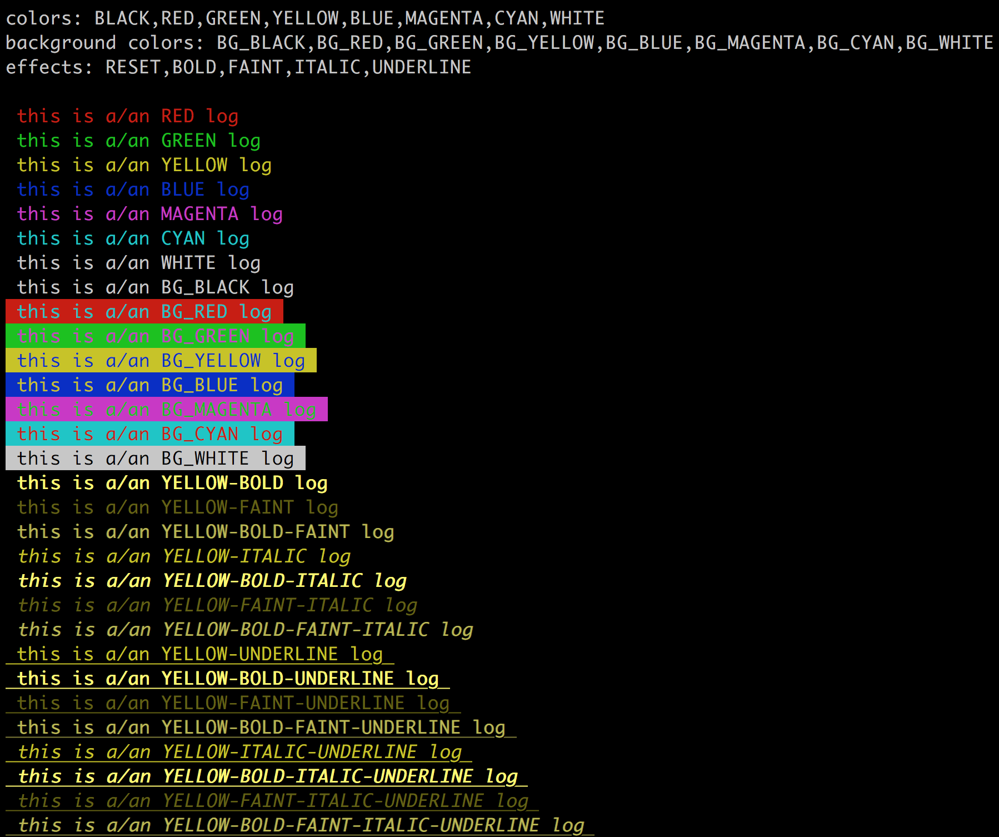
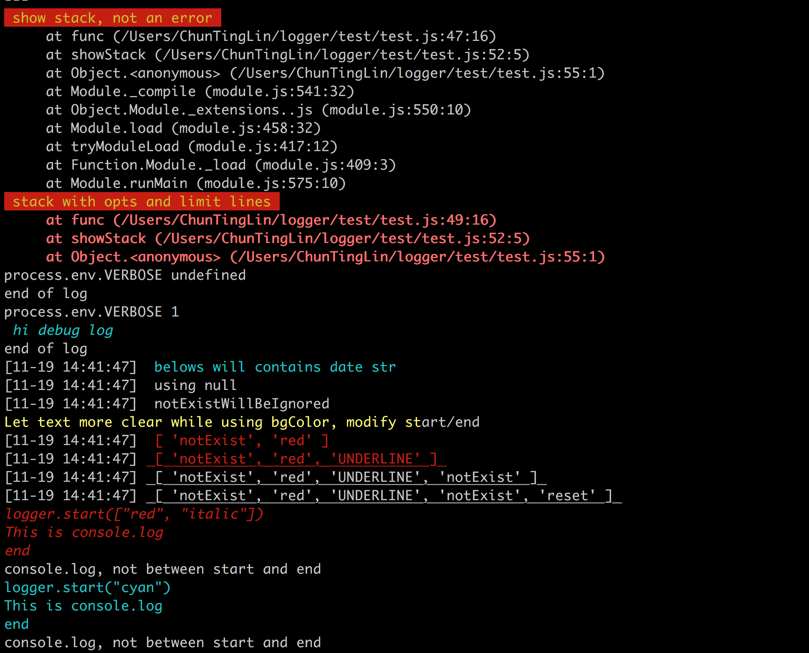

# ct-logger
log with colors,
Show log when envVar VERBOSE is set,
Show stacktrace

# How to use
```
npm install ct-logger
```

Screen shot of OSX.



# Options
Show date with format:[MM-DD HH:MM:SS]
```js
var logger = require('ct-logger');
logger.showDate = true;
```
# Usage
like console.log,
```js
var logger = require('ct-logger');
logger.colorLog('red', 'Ni', 'Hao');
logger.log(['italic', 'blue', 'bold'], 'this', 'is', 'log');
logger.debug('shows only when', 'VERBOSE', 'been', 'set');
logger.stack();
logger.stack(['red', 'bold'], 3);
```
# APIS

## log(opts, arg1, arg2, ..., argN)
Additional arg0 for what you want to call `console.log` .
Opts are an array from colors and effects.
Colors: BLACK,RED,GREEN,YELLOW,BLUE,MAGENTA,CYAN,WHITE
Effects: RESET,BOLD,FAINT,ITALIC,UNDERLINE
All opts are case-insensitive.

```js
logger.log(['italic', 'blue', 'bold'], 'this', 'is', 'log');
```

## colorLog(color, arg1, arg2, ..., argN), red(...), bgBlue(...)
color is String.
Colors: BLACK,RED,GREEN,YELLOW,BLUE,MAGENTA,CYAN,WHITE
```js
logger.colorLog('green', 'li', 'ho');
logger.colorLog('bg_red', 'li', 'ho');
// shortcut of colorLog, all colors and bg are supported
logger.red('this', 'is', 'red', 'log');
logger.bgGreen('this bg is green');
```

## debug()
This log only shows when env variable VERBOSE been set.
```js
logger.debug('shows only when', 'VERBOSE', 'been', 'set');
```
## stack(opts, maxLines)
opts is as same as `log`, maxLines is a number, which indicate max stacktrace to shows
```js
logger.stack(['red', 'bold'], 3);
```

## byCodes(codes)
You can pass other codes, and try it.
More codes see [ANSI ESCAPE CODE](https://en.wikipedia.org/wiki/ANSI_escape_code)
```js
const codeRed = logger.COLORS.RED;
const codeBackgroundBlue = logger.BG_COLORS.BG_BLUE;
logger.byCodes([codeRed, codeBackgroundBlue], 'this is a red log and bg is blue');

logger.byCodes([31, 44], 'this is a red log and bg is blue');
```

## start(opts) end()
All console.log between `start` and `end` will apply opts which you set.
```js
logger.start(['red', 'italic']);
console.log('this log is red and italic');
logger.end();
```
